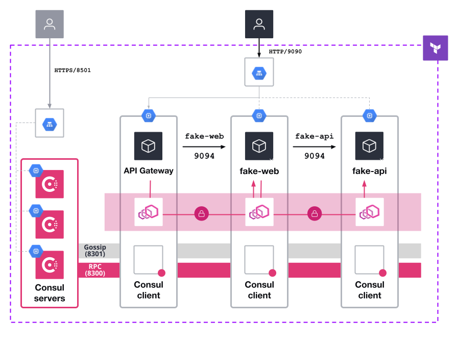

# Consul in GCP with Transparent Proxy

## Requirements
* A MacOS or Linux terminal
* Packer CLI
* Terraform CLI
* Owner of a GCP project
* `jq` command installed in your terminal
* gcloud CLI

## Context

This repo has all configuration assets to deploy Consul in GCP VMs to build an environment like in the following diagram:



Following this "readme" you will finally deploy the architecture where you can enforce traffic routing and authorization using [Consul Service Mesh](https://developer.hashicorp.com/consul/docs/connect) and [Transparent Proxy](https://developer.hashicorp.com/consul/docs/k8s/connect/transparent-proxy). And you will configure this for a VMs environment, for a non containerized scenario.

## Configure your GCP environment
Configure your GCP creds:
```
gcloud auth login
```

```
gcloud config set project <gcp_project_id>
```

## Create your image with Packer
Get into the Packer directory
```
cd packer
```

Create your variables file 
```
tee consul_gcp.auto.pkrvars.hcl <<EOF
consul_version = "1.16.3+ent"
image = "consul-ent"
image_family = "custom-consul"
sshuser = "packer"
gcp_project = "<your_gcp_project_id>"
EOF
```

Build the image that will be used later for Terraform:
```
packer build . 
```

Get out of the Packer directory
```
cd ..
```

## Deploy Consul

Get into the Terraform directory:
```
cd terraform
```

Create the variable values file (replace your values):
```
tee terraform.auto.tfvars <<EOF
gcp_region = "europe-southwest1"
gcp_zone = "europe-southwest1-c"
gcp_project = "<gcp_project_id>"
gcp_instance = "n2-standard-2"
numnodes = 3
numclients = 2
# One of the names that you should see from "gcloud iam service-accounts list --format="table(NAME)""
gcp_sa = "<service_account_name>"
cluster_name = "consul-gcp-demo"
owner = "<owner_nickname>"
image_family = "custom-consul"
consul_license = "<your_Consul_Ent_license_string>"
consul_bootstrap_token = "Consul43v3r"
enable_cts = false
EOF
```


## Transparent proxy use case
We will deploy two applications (one per client node) to demonstrate how transparent proxy works to isolate the traffic between the applications authorized by Consul intentions.

Let's deploy and configure first an API demo application in the first client node

### Client Node 1

Connect to the first client node:
```
eval $(terraform output -json gcp_clients | jq -r .[0])
```

Use a Consul token in an env variable for following steps:
```
export CONSUL_HTTP_TOKEN="Consul43v3r"
```

We create a `fake-api.service` file to deploy the application ():

```
sudo tee /usr/lib/systemd/system/fake-api.service <<EOF
[Unit]
Description=API demo service
After=syslog.target network.target

[Service]
Environment=MESSAGE="API Response"
Environment=NAME="API"
Environment=LISTEN_ADDR="0.0.0.0:9094"
ExecStart=/usr/local/bin/fake-service
ExecStop=/bin/sleep 5
Restart=always

[Install]
WantedBy=multi-user.target
EOF
```

> NOTE: `/usr/local/bin/fake-service` should be already installed by the previous Terraform deployment. If you want to manually download it, you can do it [from here](https://github.com/nicholasjackson/fake-service/releases/tag/v0.26.0).

And reload the services daemon:
```
sudo systemctl daemon-reload
```


Let's create a service to be registered in Consul:
```
tee fake-api.hcl <<EOF
service {
  name = "fake-api"
  id = "fake-api"
  tags = ["backend", "api"]
  port = 9094


  check {
    id =  "check-fake-api",
    name = "api status check",
    service_id = "fake-api",
    tcp  = "localhost:9094",
    interval = "5s",
    timeout = "5s"
  }

  connect {
    sidecar_service {
      proxy {
        mode = "transparent"
      }
    }
  }
}
EOF
```

And register the service:
```
consul services register -token Consul43v3r fake-api.hcl
```

The service `fake-api` should be already registered in Consul, but nothing is running, so it will be an "unhealthy" service in Consul catalog.

Let's now run the application:
```
sudo systemctl start fake-api
```

Check the application is running:
```
curl localhost:9094
```

Check that the user `envoy` exists (it should be created in the VM creation in Terraform):
```
grep envoy /etc/passwd
```

Now we will use the [`redirect-traffic` command](https://developer.hashicorp.com/consul/commands/connect/redirect-traffic) in Consul to automatically apply the `iptable` rules to enable the Transparent Proxy
 
```
 sudo consul connect redirect-traffic -proxy-uid $(id --user envoy) \
 -proxy-id fake-api-sidecar-proxy \
 -exclude-uid $(id --user consul) \
 -exclude-uid $(id --user _apt) \
 -exclude-inbound-port 22 \
 -token Consul43v3r
```

In this case we are forcing all the fraffic to go through Envoy, except those executed by `consul` or `_apt` users. We do this for demo purposes to not block the node to access internet for some provileged workloads (being able to update with `apt update`, for example). Also, we are excluding the 22 port to be able to access the node through ssh.

Check that the rules have been applied to `iptables`:
```
sudo iptables -L -t nat
```

You can confirm that the traffic is filtered now by trying to access to an URL without and with root privileges (because Envoy is not still running):
```
curl -L hashicorp.com
sudo -u consul curl -L hashicorp.com
```

Before running the Envoy proxy, let's create a `service identity` ACL token for the Envoy:
```
echo "CONSUL_HTTP_TOKEN=$(consul acl token create -format json -service-identity fake-api -token Consul43v3r | jq -r .SecretID)" | sudo tee /etc/envoy.d/sidecar_config/fake-api.env
```

You can check that the token has been created in Consul:
```
consul acl token list -format json -token Consul43v3r | jq '.[] | select(.ServiceIdentities[0].ServiceName == "fake-api")'
```

> NOTE: If you exported the `CONSUL_HTTP_TOKEN` variable witht the bootstrap token at the beginning you can remove the `-token` parameter from the commands

Now let's run the envoy to force all the traffic go through it:
```
sudo systemctl start envoy@fake-api.service
```

> NOTE: You could run manualy the proxy with the following command
> ```
> sudo su envoy -c "nohup consul connect envoy -sidecar-for fake-web -token Consul43v3r > /tmp/envoy.log &"
> ```

### Client Node 2
Connect to the second client node:
```
eval $(terraform output -json gcp_clients | jq -r .[1])
```

Use a Consul token in an env variable for following steps:
```
export CONSUL_HTTP_TOKEN="Consul43v3r"
```

We will do the same thing in the second client node, but for a demo app called `web` with a service called `fake-web.service`.

```
sudo tee /usr/lib/systemd/system/fake-web.service <<EOF
[Unit]
Description=Web Service
After=syslog.target network.target

[Service]
Environment=MESSAGE="Web Response"
Environment=NAME="web"
Environment=LISTEN_ADDR="0.0.0.0:9094"
Environment=UPSTREAM_URIS="http://fake-api.virtual.consul:9094"
Environment=HTTP_CLIENT_REQUEST_TIMEOUT="5s"
ExecStart=/usr/local/bin/fake-service
ExecStop=/bin/sleep 5
Restart=always

[Install]
WantedBy=multi-user.target
EOF
```

And reload the services daemon:
```
sudo systemctl daemon-reload
```

Let's create a service to be registered in Consul:
```
tee fake-web.hcl <<EOF
service {
  name = "fake-web"
  id = "fake-web"
  tags = ["frontend", "web"]
  port = 9094


  check {
    id =  "check-fake-web",
    name = "web status check",
    service_id = "fake-web",
    tcp  = "localhost:9094",
    interval = "5s",
    timeout = "5s"
  }

  connect {
    sidecar_service {
      proxy {
        mode = "transparent"
      }
    }
  }
}
EOF
```

And register the service:
```
consul services register -token $CONSUL_HTTP_TOKEN fake-web.hcl
```

> NOTE: It is not necessary to use `-token $CONSUL_HTTP_TOKEN` if the environment variable is defined, but you can anyway force putting it.

The service `fake-web` should be already registered in Consul but nothing is running, so it will be an "unhealthy" service in the Consul catalog.

Let's now run the application:
```
sudo systemctl start fake-web
```

Check that the user `envoy` exists (it should be created in the VM creation in Terraform):
```
grep envoy /etc/passwd
```

Now, let's force the traffic to go through the Consul Envoy:

```
 sudo consul connect redirect-traffic -proxy-uid $(id --user envoy) \
 -proxy-id fake-web-sidecar-proxy \
 -exclude-uid $(id --user consul) \
 -exclude-uid $(id --user _apt) \
 -exclude-inbound-port 22 \
 -token $CONSUL_HTTP_TOKEN
```

Before running the Envoy proxy, lcreate the `service identity` ACL token:
```
echo "CONSUL_HTTP_TOKEN=$(consul acl token create -format json -service-identity fake-web -token $CONSUL_HTTP_TOKEN | jq -r .SecretID)" | sudo tee /etc/envoy.d/sidecar_config/fake-web.env
```

Chek again that the token for `fake-web` has been created in Consul:
```
consul acl token list -format json -token $CONSUL_HTTP_TOKEN | jq '.[] | select(.ServiceIdentities[0].ServiceName == "fake-web")'
```

And run the sidecar proxy:
```
sudo systemctl start envoy@fake-web.service
```

## Applying Consul intentions to check traffic

We remain on the client node where the web application is running.

Using Consul DNS, the `fake-api` service is discoverable:
```
host fake-api.service.consul

host fake-web.virtual.consul
```

But we can confirm that API service is not accessible:
```
curl fake-api.virtual.consul
```

That is because Consul has a `deny all` policy by default, so services cannot be reachable (because all traffic is going through the Envoy proxy)

Let's then create the authorization `fake-web --> fake-api` by creating the corresponding Consul intention:
```
consul config write -token $CONSUL_HTTP_TOKEN - <<EOF
Kind = "service-intentions"
Name = "fake-api"
Sources = [

  {
    Name   = "fake-web"
    Action = "allow"
  }
]
EOF
```

Now we can check that the `fake-api` service is accessible from `fake-web` node:
```
curl fake-api.virtual.consul
```

From the application we can see that `fake-web` is able to reach `fake-api`:
```
$ curl localhost:9094
{
  "name": "web",
  "uri": "/",
  "type": "HTTP",
  "ip_addresses": [
    "10.2.0.8",
    "172.17.0.1"
  ],
  "start_time": "2023-11-22T13:58:06.574258",
  "end_time": "2023-11-22T13:58:06.575790",
  "duration": "1.532063ms",
  "body": "Web Response",
  "upstream_calls": {
    "fake-api.virtual.consul:9094": {
      "name": "API",
      "uri": "http://fake-api.virtual.consul:9094",
      "type": "HTTP",
      "ip_addresses": [
        "10.2.0.10",
        "172.17.0.1"
      ],
      "start_time": "2023-11-22T13:58:06.575246",
      "end_time": "2023-11-22T13:58:06.575340",
      "duration": "94.337µs",
      "headers": {
        "content-type": "application/grpc"
      },
      "body": "API Response",
      "code": 0
    }
  },
  "code": 200
}
```

## Using an API Gateway to access the mesh

Let's deploy a new client node where our [API Gateway](https://developer.hashicorp.com/consul/docs/connect/gateways/api-gateway) will run. We do this by changing in the Terraform values `numclients = 3`. And we apply the new Terraform (this is done in the `terraform/` directory from our repo):
```
terraform apply -var numclients=3 
```

Once the Terraform has benn successfuly applied, let's connect to the new VM:
```
eval $(terraform output -json gcp_clients | jq -r .[2])
```

Within the GCP VM terminal, let's create our [API Gateway configuration entry](https://developer.hashicorp.com/consul/docs/connect/config-entries/api-gateway):
```
tee api-gateway.hcl <<EOF
Kind = "api-gateway"
Name = "api-gateway"

Listeners = [
    {
        Port = 9090
        Name = "gw-tcp-listener"
        Protocol = "tcp"
    }
]
EOF
```

And now a [TCP route](https://developer.hashicorp.com/consul/docs/connect/config-entries/tcp-route) that will tell our API listener to route traffic to the `fake-web` service:
```
tee tcp-route.hcl << EOF
Kind = "tcp-route"
Name = "tcp-route"

// Rules define how requests will be routed
Services = [
  {
    Name = "fake-web"
  }
]
Parents = [
  {
    Kind = "api-gateway"
    Name = "api-gateway"
    SectionName = "gw-tcp-listener"
  }
]
EOF
```

Let's apply our configurations:
```
consul config write -token Consul43v3r api-gateway.hcl
consul config write -token Consul43v3r tcp-route.hcl
```

Now, we need to run the gateway in the node:
```
consul connect envoy -gateway api -register -service api-gateway -token Consul43v3r &
```

And last, but not least, we need to authorize the traffic with the corresponding Consul intention:
```
tee fake-web-intentions.hcl << EOF
Kind = "service-intentions"
Name = "fake-web"
Sources = [
  {
    Name   = "api-gateway"
    Action = "allow"
  }
]
EOF
```

```
consul config write -token Consul43v3r fake-web-intentions.hcl
```

You should be able to connect to our application from the outside:
```
curl http://$(terraform output --raw apps_load_balancer):9090
```
